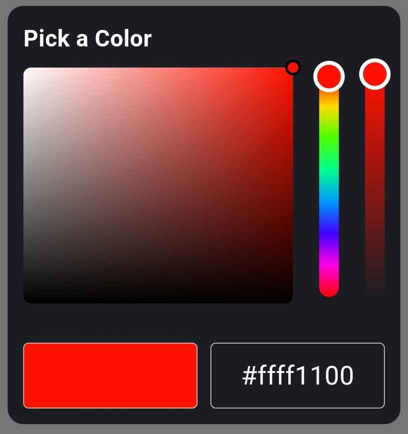
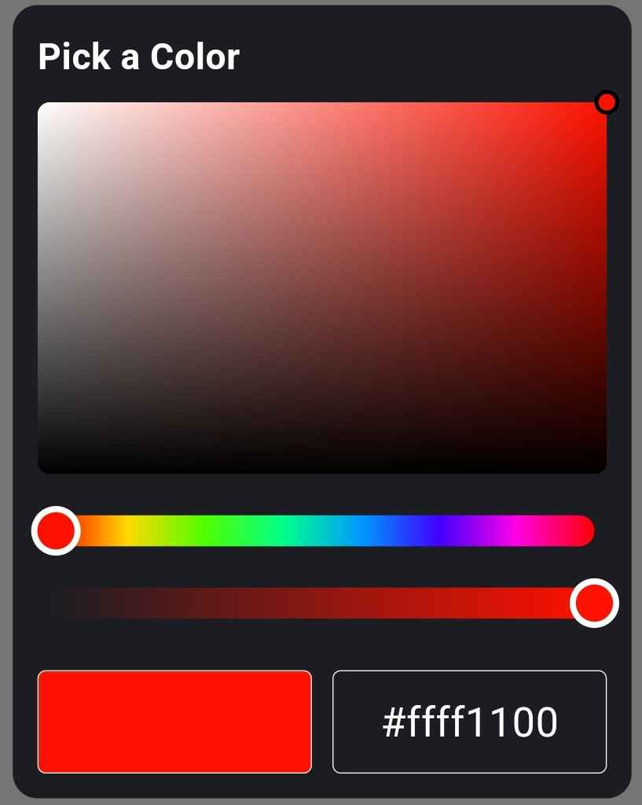

# hue_craft
A simple package for building custom color pickers in Flutter


## Examples

<div style="display: flex; gap: 10px;">
  
  
</div>

# Widgets Included
- HorizontalHuePicker
- VerticalHuePicker
- HorizontalOpacityPicker
- VerticalOpacityPicker
- SaturationValuePicker


If you want to build a custom thumb (or selector) for the widgets provided with this package, you can do so by implementing the CustomPainter class. This allows you to design a thumb that matches your unique style. To do this:

- Create a class, e.g., CustomThumb, that extends CustomPainter. 
- Implement the paint and shouldRepaint methods to define the appearance of your thumb (or selector).

```dart
class SquareThumbPainter extends CustomPainter {
  final double width;
  final double height;
  final Color squareColor;
  final double borderWidth;

  SquareThumbPainter({
    required this.width,
    required this.height,
    required this.squareColor,
    this.borderWidth = 2.0,
  });

  @override
  void paint(Canvas canvas, Size size) {
    final Paint fillPaint = Paint()..color = squareColor;
    final Paint borderPaint = Paint()
      ..color = Colors.white
      ..style = PaintingStyle.stroke
      ..strokeWidth = borderWidth;

    final Rect rect = Rect.fromCenter(
      center: Offset(size.width / 2, size.height / 2),
      width: width,
      height: height,
    );
    canvas.drawRect(rect, fillPaint);
    canvas.drawRect(rect, borderPaint);
  }

  @override
  bool shouldRepaint(covariant CustomPainter oldDelegate) {
    return true;
  }
}
```

Now you can pass its instance to any widget provided with this package. For example:

```dart
HorizontalHuePicker(
  customThumbPainter: SquareThumbPainter(...),
  ...
)
```

You can do the same with rest of the widgets.